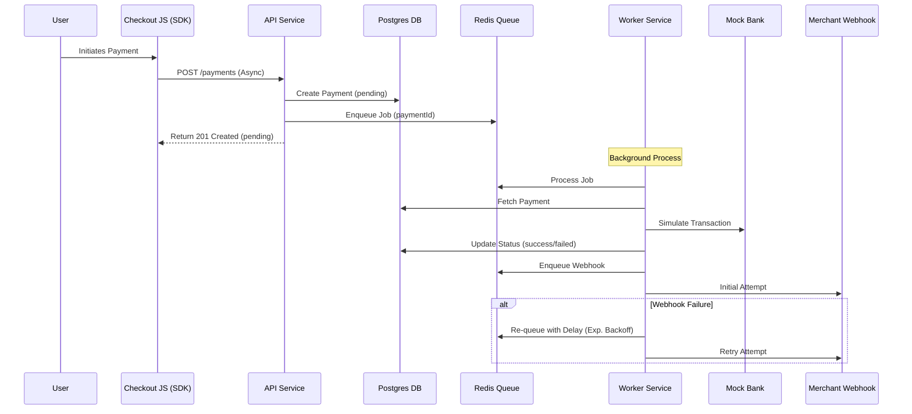
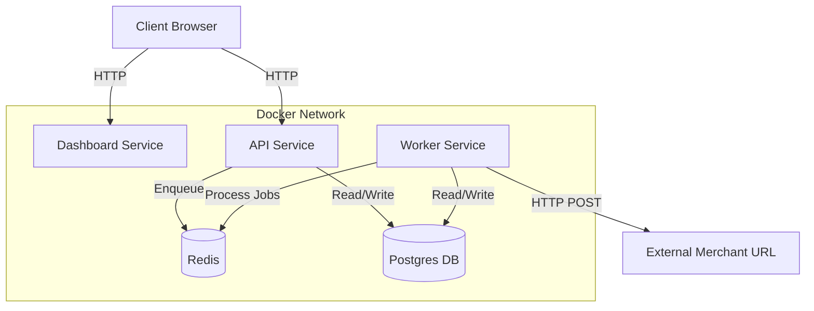

# System Architecture

## Async Payment Flow

```mermaid
sequenceDiagram
    participant User
    participant Checkout as Checkout JS (SDK)
    participant API as API Service
    participant DB as Postgres DB
    participant Queue as Redis Queue
    participant Worker as Worker Service
    participant Bank as Mock Bank
    participant Webhook as Merchant Webhook

    User->>Checkout: Initiates Payment
    Checkout->>API: POST /payments (Async)
    API->>DB: Create Payment (pending)
    API->>Queue: Enqueue Job (paymentId)
    API-->>Checkout: Return 201 Created (pending)
    
    Note over Worker: Background Process
    Worker->>Queue: Process Job
    Worker->>DB: Fetch Payment
    Worker->>Bank: Simulate Transaction
    Worker->>DB: Update Status (success/failed)
    
    Worker->>Queue: Enqueue Webhook
    Worker->>Webhook: Initial Attempt
    
    alt Webhook Failure
        Worker->>Queue: Re-queue with Delay (Exp. Backoff)
        Worker->>Webhook: Retry Attempt
    end
```

## Component Overview

```mermaid
graph TD
    Client[Client Browser] -->|HTTP| Dashboard[Dashboard Service]
    Client -->|HTTP| API[API Service]
    
    subgraph "Docker Network"
        Dashboard
        API
        Worker[Worker Service]
        Redis[(Redis)]
        DB[(Postgres DB)]
    end
    
    API -->|Read/Write| DB
    API -->|Enqueue| Redis
    
    Worker -->|Process Jobs| Redis
    Worker -->|Read/Write| DB
    Worker -->|HTTP POST| Webhook[External Merchant URL]
```
